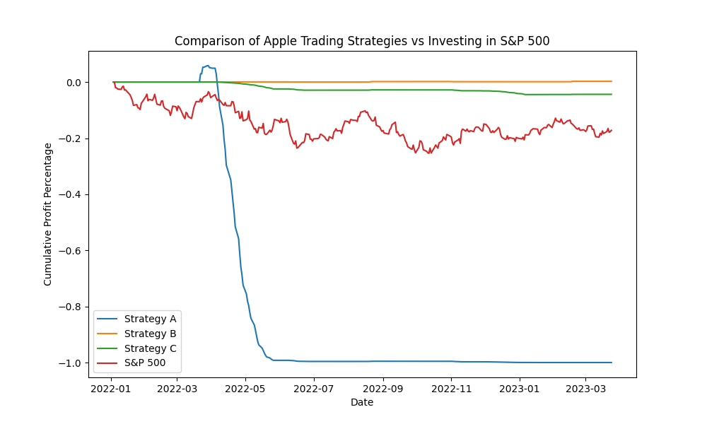

# TradeBot: Apple Trading Strategy Comparison
My dad couldn't stop bragging about how he can out-trade everybody so I decide to **quantitatively** slap his face by building this instead of caching up my 5 weeks worth of ECE259.
This repository contains a set of Python scripts that implement and compare different trading strategies for Apple Inc. (AAPL) stock. The main purpose of this project is to explore various trading algorithms and evaluate their performance against a buy-and-hold strategy in the S&P 500 index.

## Table of Contents

- [Features](#features)
- [Installation](#installation)
- [Usage](#usage)
- [Contributing](#contributing)
- [License](#license)

## Features

- Retrieves historical stock price data for Apple Inc. and the S&P 500 index.
- Calculates and applies technical indicators (e.g., moving averages, RSI, and MACD) to the data.
- Implements various trading strategies and iterates over the data to simulate trades.
- Calculates and plots cumulative profit percentages for each strategy.
- Compares the performance of each strategy to the S&P 500 index.

## Installation

To get started with this project, follow these steps:

1. Clone the repository:
    ```angular2html
    git clone https://github.com/your_username/tradebot.git
    ```
2. Create a virtual environment and activate it:
    ```angular2html
    python -m venv venv
    source venv/bin/activate # for Unix-based systems
    venv\Scripts\activate # for Windows
    ```
3. Install the required dependencies:
    ```angular2html
    pip install -r requirements.txt
    ```


## Usage

1. Open the `main.py` file and set the appropriate API key for the data provider.

2. Adjust the trading strategy parameters and the stock data timeframe as needed.

3. Run the `main.py` script:

    ```angular2html
    python main.py
    ```
   

4. Analyze the results by examining the cumulative profit percentage plots and the printed total returns and profits for each strategy.
    ```angular2html
    Enter start time (yyyy-mm-dd): 2022-01-01
    Strategy A Profit: -99.96%
    Strategy B Profit: 0.25%
    Strategy C Profit: -4.38%
    S&P 500 Profit: -17.21%
    ```
    
## Contributing

We welcome contributions to improve the existing strategies or to add new ones. If you would like to contribute, please follow these steps:

1. Fork the repository.

2. Create a new branch with a descriptive name for your changes:

    ```angular2html
    git checkout -b my_new_feature
    ```

3. Make your changes, commit them, and push the branch to your fork:

    ```angular2html
    git add .
    git commit -m "Added my new feature"
    git push origin my_new_feature
    ```

4. Create a pull request with a clear description of your changes.

## License

This project is released under the MIT License. See the [LICENSE](LICENSE) file for more details.


